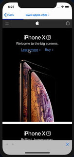
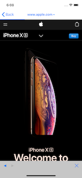
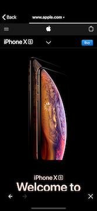

# WebController

[](https://cocoapods.org/pods/WebController)
[](https://cocoapods.org/pods/WebController)
[](https://cocoapods.org/pods/WebController)
[](https://developer.apple.com/swift/)

## Introduce

A simple WKWebView library.
You can simply modify the bottom ToolBar.
There is a ProgressView so you can see the Load status of WebView.
Once you receive your app's schema from DeepLink or UniversalLink on your website, you can open the app.




<br><br>




## Requirements

`WebController` written in Swift 4. Compatible with iOS 8.0+

## Installation

### Cocoapods

WebController is available through [CocoaPods](http://cocoapods.org). To install
it, simply add the following line to your Podfile:

```ruby
pod 'WebController'
```

## Usage

```swift
import WebController
```

```swift
let webController = WebController()
webController.load("http://www.apple.com")
self.navigationController?.pushViewController(webController, animated: true)
```
done!

<br><br><br>


### Property

WebController

```swift

//WKWebView
webController.webView

//The UIProgressView that appears above the WebView when the site loads
webController.progressView

//The UIActivityIndicatorView that appears in the center of the webview when the site loads
webController.indicatorView

//A UIView that wraps around the bottom UIToolbar.
webController.toolView

//Paints the title color of the UINavigationBar.
webController.titleTintColor

//Paints the background color of the UINavigationBar.
webController.barTintColor

```

ToolView

```swift

//UIToolbar
webController.toolView.toolbar

//Paints the colors of the UIToolbar's items.
webController.toolView.itemTintColor

//Paints the background color of the UIToolbar.
webController.toolView.barTintColor

//Hide the ToolBar's Refresh UIBarButtonItem, Stop UIBarButtonItem. Default is false.
webController.toolView.isHiddenRefresh

//Hides the ToolBar at the bottom of the WebController. Default is false.
webController.toolView.isHiddenToolBar

```

<br><br>

### Method

WebController load

```swift
webController.load("http://www.apple.com")
```

ToolView UIBarButtonItem

```swift
webController.toolView.setBackBarButtonItem("<")
webController.toolView.setBackBarButtonItem(UIImage(named: ""))
webController.toolView.setForwardBarButtonItem(">")
webController.toolView.setForwardBarButtonItem(UIImage(named: ""))
```


<br><br>

### Delegate

```swift
class ViewController: UIViewController {

  override func viewDidLoad() {
    super.viewDidLoad()

    let webController = WebController()
    webController.delegate = self
  }

}

extension ViewController: WebControllerDelegate {

/**
Called when title changes.
- Parameters:
- webController: WebControllerDelegate The UIViewController invoking the delegate method.
- didChangeTitle: The title to change.
*/
func webController(_ webController: WebController, didChangeTitle: String?) {

}

/**
Called when url changes.
- Parameters:
- webController: WebControllerDelegate The UIViewController invoking the delegate method.
- didChangeURL: The url to change.
*/
func webController(_ webController: WebController, didChangeURL: URL?) {

}

/**
It is called when the load starts or ends.
- Parameters:
- webController: WebControllerDelegate The UIViewController invoking the delegate method.
- didLoading: load starts or ends.
*/
func webController(_ webController: WebController, didLoading: Bool) {

}

/**
Called when title changes.
- Parameters:
- webController: WebControllerDelegate The UIViewController invoking the delegate method.
- title: will change based on the return value.
- Returns: UINavigationTitle is changed. default is changed to title which is received as argument.
*/
func webController(_ webController: WebController, title: String?) -> String? {

}

/**
It will be called when the site becomes an Alert.
- Parameters:
- webController: WebControllerDelegate The UIViewController invoking the delegate method.
- alertController: This is an alert window that will appear on the screen.
- didUrl: The website URL with the alert window.
*/
func webController(_ webController: WebController, alertController: UIAlertController, didUrl: URL?) {

}

/**
If the website fails to load, the Alert is called.
- Parameters:
- webController: WebControllerDelegate The UIViewController invoking the delegate method.
- alertController: This is an alert window that will appear on the screen.
- didUrl: The website URL with the alert window.
*/
func webController(_ webController: WebController, failAlertController: UIAlertController, didUrl: URL?) {

}

/**
If the scheme is not http or https, think of it as a deep link or universal link
- Parameters:
- webController: WebControllerDelegate The UIViewController invoking the delegate method.
- openUrl: Url to use 'UIApplication.shared.openURL'.
- Returns: Return true to use 'UIApplication.shared.openURL'. default is true.
*/
func webController(_ webController: WebController, openUrl: URL?) -> Bool {

}

/**
Decides whether to allow or cancel a navigation.
- Parameters:
- webController: WebControllerDelegate The UIViewController invoking the delegate method.
- navigationAction: Descriptive information about the action triggering the navigation request.
- decisionHandler: The decision handler to call to allow or cancel the navigation. The argument is one of the constants of the enumerated type WKNavigationActionPolicy.
*/
func webController(_ webController: WebController, navigationAction: WKNavigationAction, decisionHandler: (WKNavigationActionPolicy) -> Void) {

}

/**
Decides whether to allow or cancel a navigation after its response is known.
- Parameters:
- webController: WebControllerDelegate The UIViewController invoking the delegate method.
- navigationResponse: Descriptive information about the navigation response.
- decisionHandler: decisionHandler The decision handler to call to allow or cancel the navigation. The argument is one of the constants of the enumerated type WKNavigationResponsePolicy.
*/
func webController(_ webController: WebController, navigationResponse: WKNavigationResponse, decisionHandler: (WKNavigationResponsePolicy) -> Void) {

}

/**
Invoked when the web view needs to respond to an authentication challenge.
- Parameters:
- webController: WebControllerDelegate The UIViewController invoking the delegate method.
- challenge: The authentication challenge.
- completionHandler: The completion handler you must invoke to respond to the challenge. The disposition argument is one of the constants of the enumerated type NSURLSessionAuthChallengeDisposition. When disposition is NSURLSessionAuthChallengeUseCredential, the credential argument is the credential to use, or nil to indicate continuing without a credential.
*/
func webController(_ webController: WebController, challenge: URLAuthenticationChallenge, completionHandler: (URLSession.AuthChallengeDisposition, URLCredential?) -> Void) {

}

}

```

<br><br>

### Customize

WebController Customize

```swift
let webController = WebController()
webController.delegate = self
webController.toolView.setBackBarButtonItem(UIImage(named: "icBack"))
webController.toolView.setForwardBarButtonItem(UIImage(named: "icFront"))
webController.toolView.tintColor = .white
webController.toolView.barTintColor = UIColor.black
webController.toolView.toolbar.isTranslucent = false
webController.barTintColor = .black
webController.titleTintColor = .white
webController.progressView.trackTintColor = .white
webController.progressView.progressTintColor = .black
webController.indicatorView.color = .white
webController.load("https://www.google.com")
self.navigationController?.pushViewController(webController, animated: true)
```

## Author

pikachu987, pikachu77769@gmail.com

## License

WebController is available under the MIT license. See the LICENSE file for more info.
